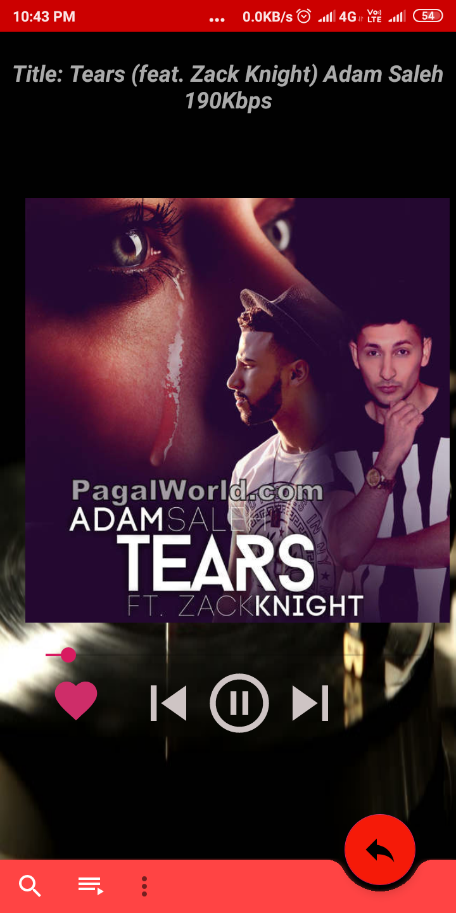
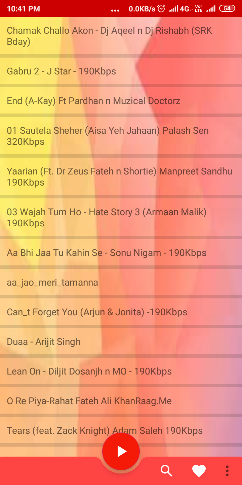
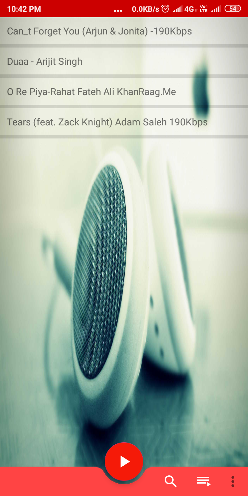
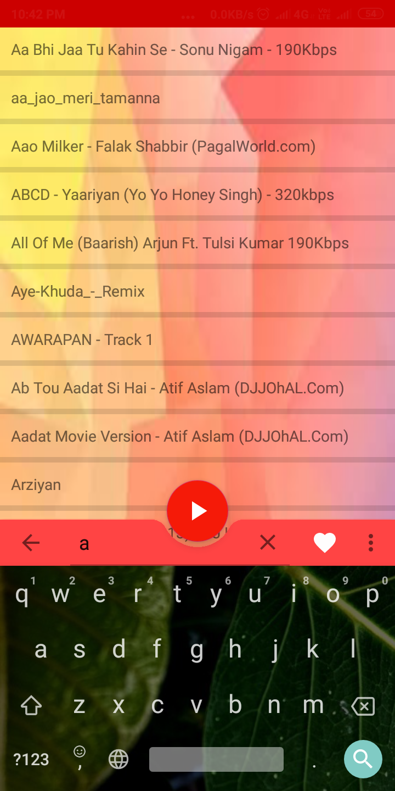

# Media_player
it is a light weight app which fetch local storage music and play it .

It is very user friendly

This app is compatable with API 28.
If you are useing a device lower than API 26 app may not be work properly....

In my device(ApI level 27) this app works properly(The screen short is given).
This app dose not contains any resourse audio file. It fetch audio (mp3/wav)files from device(Internal&Externalstorage). 

# Screenshots
 

 	

 			

 			
 			
<h3>Plyear</h3>		

 			

 		

 	

 			

 			
 			
<h3>Playlist</h3>		

 			

 		

 	

 			

 			
 			
<h3>save songs in fevrout list</h3>		

 			

 		

  	

 			

 			
 			
<h3>menu</h3>		

 			

 		

 	

 			

 			
 			
<h3>Search for songs</h3>		

 			

 		

 

>>>>>>>>>>>>>>>>>>>>>>>>>>>>>>>>>>>>Thankyou<<<<<<<<<<<<<<<<<<<<<<<<<<<<<<<<<<<<<<<<<<<<<<<

